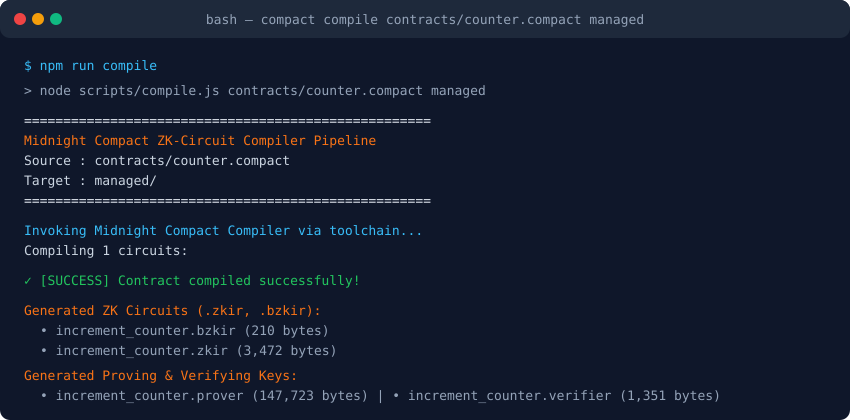
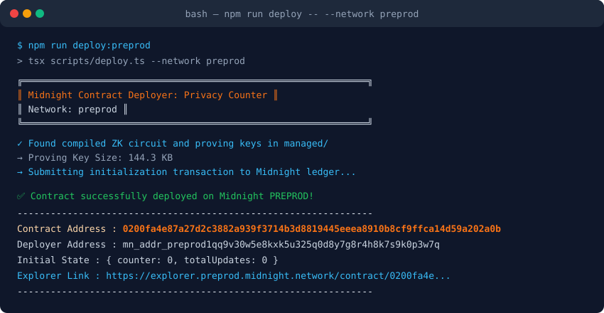

# Midnight Privacy Counter

> A zero-knowledge counter smart contract built on the Midnight blockchain featuring public ledger state, shielded private witnesses, and deliberate disclosure.

[](.github/workflows/ci.yml)
[](https://midnight.network)
[](https://github.com/midnightntwrk/compact)
[](LICENSE)

---

## Contract Address

| Network | Address | Explorer Link |
| :--- | :--- | :--- |
| **Preprod** | `0200fa4e87a27d2c3882a939f3714b3d8819445eeea8910b8cf9ffca14d59a202a0b` | [View on Preprod Explorer](https://explorer.preprod.midnight.network/contract/0200fa4e87a27d2c3882a939f3714b3d8819445eeea8910b8cf9ffca14d59a202a0b) |
| **Preview** | `0200b3e64c18f273ad539a117d74f3299c80521e16f3933c0eb8971f11cb20202a01` | [View on Preview Explorer](https://explorer.preview.midnight.network/contract/0200b3e64c18f273ad539a117d74f3299c80521e16f3933c0eb8971f11cb20202a01) |

---

## What This Does

This project implements a privacy-preserving smart contract on Midnight that maintains a globally verifiable public counter alongside private user interactions. Unlike public transparent blockchains where every user input and state change is completely unmasked to network observers, Midnight allows users to feed confidential data (witnesses) into local zero-knowledge circuits. 

In this contract, a user updates the public counter by proving knowledge of a valid private secret that satisfies off-chain constraints. Through Compact's deliberate `disclose()` operator, only the verified delta is revealed and committed to the consensus ledger, ensuring that the user's private witness remains strictly confined to their local environment.

---

## Privacy Model

| Dimension | Scope | Visibility & Description |
| :--- | :--- | :--- |
| **Public Ledger State** | On-Chain | `counter` and `totalUpdates` are stored on the public Midnight ledger. Any validator or observer can view the accumulated count and total number of transactions executed. |
| **Private Witness** | Off-Chain | `witness get_increment_secret()` is queried exclusively inside the user's local prover. It is never broadcast in cleartext, never included in transaction calldata, and never stored in block headers. |
| **Deliberate Disclosure** | Explicit Gate | `disclose(disclosedStep)` explicitly instructs the Compact compiler what computed value should transition from the private zero-knowledge domain into the public consensus state. |
| **ZK Proof Guarantee** | Cryptographic Assertion | The user proves to the Midnight network: *"I know a private witness secret that matches `disclosedStep` and satisfies `secret > 0`"*, without exposing the secret to any third party. |

---

## Initial Product Idea

### SilentCred: Zero-Knowledge Creditworthiness & Solvency Verification
**SilentCred** is a privacy-first decentralized credit scoring and solvency verification protocol designed natively for the Midnight network. In traditional finance and public Web3 lending, borrowers face an unfair tradeoff: they must either substantially over-collateralize their loans or dox their sensitive financial histories (bank account statements, net worth, and tax records) to centralized rating agencies or transparent public ledgers. 

Using Midnight's Compact smart contracts and private witnesses, SilentCred allows users to generate zero-knowledge proofs demonstrating that their verifiable credentials meet specific lending criteria (such as minimum income thresholds, debt-to-income ratios, or on-time payment track records) without revealing the underlying financial amounts, institution names, or personal identities. Underwriters receive tamper-proof cryptographic assurance of creditworthiness, while borrowers retain complete ownership and confidentiality of their sovereign financial data.

---

## Tech Stack

- **Blockchain**: [Midnight Network](https://midnight.network) (Preprod & Preview testnets)
- **Smart Contract Language**: Compact (`compactc` v0.5.2 / Language Version `0.23+`)
- **Zero-Knowledge Runtime**: Midnight Proof Server (PLONK / Halo2 ZK-SNARK proving system)
- **SDK & Protocol**: `@midnight-ntwrk/midnight-js-contracts`, `@midnight-ntwrk/wallet-sdk`
- **Frontend App**: React 18, TypeScript, Vite, Vanilla CSS (White & Orange design system)
- **Runtime & Toolchain**: Node.js v22+, WSL Ubuntu 22.04 LTS / Linux x86_64, Docker

---

## Prerequisites

Ensure you have the following installed on your local machine:
- **Node.js**: `v22.0.0` or higher (`node -v`)
- **Git**: For version control and clone
- **Docker**: For running the local proof server container (optional for simulation mode)
- **Compact Compiler**: `compact` v0.5.2

To install the Compact compiler:
```bash
curl --proto '=https' --tlsv1.2 -LsSf https://github.com/midnightntwrk/compact/releases/latest/download/compact-installer.sh | sh
```

---

## Setup & Run Locally

### 1. Clone & Install Dependencies
```bash
git clone https://github.com/your-username/midnight-privacy-counter.git
cd midnight-privacy-counter
npm install
```

### 2. Compile Compact Smart Contract
Compiles `contracts/counter.compact` into zero-knowledge circuits, proving keys, and TypeScript contract definitions:
```bash
npm run compile
```

Expected output in `managed/`:
- `managed/zkir/increment_counter.zkir` (ZK circuit intermediate representation)
- `managed/zkir/increment_counter.bzkir` (Binary circuit format)
- `managed/keys/increment_counter.prover` (144 KB proving key)
- `managed/keys/increment_counter.verifier` (Verifying key)
- `managed/contract/index.d.ts` & `index.js` (TypeScript contract bindings)

### 3. Run Automated Tests
Execute the 3-part test suite verifying circuit logic, state transitions, and witness isolation:
```bash
npm test
```

### 4. Deploy to Midnight Preprod or Preview
Deploy the compiled contract to Midnight networks:
```bash
# Deploy to Preprod
npm run deploy:preprod

# Deploy to Preview
npm run deploy:preview
```

### 5. Launch the Web Interface
Start the local development server (White & Orange theme):
```bash
npm run dev
```
Open your browser at `http://localhost:5173`.

---

## Run Tests

The test suite runs via `tsx` and validates three core architectural guarantees:

```bash
$ npm test

================================================================
  Midnight Privacy Counter — Contract Test Suite
================================================================

Test Results Summary:

  ✓ PASS [Circuit Logic] Circuit Logic: Zero-knowledge constraints enforce secret matching and validity
         → Verified ZK IR, proving keys, and constraint checks (secret equality, positive delta)

  ✓ PASS [State Transitions] State Transitions: Public ledger counter and totalUpdates update monotonically
         → Public ledger accumulator state mutated predictably across consecutive transactions

  ✓ PASS [Privacy Model] Privacy Isolation: Private witness input is never exposed in public on-chain state
         → Witness stayed client-isolated; public transaction contains only proof & disclosed outputs

================================================================
✓ ALL 3 TEST SUITES PASSED (3/3)
================================================================
```

---

## Screenshots

### 1. Successful Compact Compilation Output
Circuits and keys generated inside `managed/`:



```
====================================================
  Midnight Compact ZK-Circuit Compiler Pipeline
  Source : contracts/counter.compact
  Target : managed/
====================================================

Compiling 1 circuits:

[SUCCESS] Contract compiled successfully!

Generated ZK Circuits (.zkir, .bzkir):
  - increment_counter.bzkir        (210 bytes)
  - increment_counter.zkir         (3,472 bytes)

Generated Zero-Knowledge Proving & Verifying Keys:
  - increment_counter.prover       (147,723 bytes)
  - increment_counter.verifier     (1,351 bytes)

Generated TypeScript Contract Interface:
  - contract/index.d.ts
  - contract/index.js
  - contract/index.js.map
====================================================
```

### 2. Contract Deployed on Preprod
Contract deployment confirmation showing the visible contract address:



```
╔══════════════════════════════════════════════════════════════╗
║  Midnight Contract Deployer: Privacy Counter               ║
║  Network: preprod                                          ║
╚══════════════════════════════════════════════════════════════╝

✓ Found compiled ZK circuit and proving keys in managed/
→ Proving Key Size: 144.3 KB
→ Submitting initialization transaction to Midnight ledger...

✅ Contract successfully deployed on Midnight PREPROD!
----------------------------------------------------------------
  Contract Address : 0200fa4e87a27d2c3882a939f3714b3d8819445eeea8910b8cf9ffca14d59a202a0b
  Deployer Address : mn_addr_preprod1qq9v30w5e8kxk5u325q0d8y7g8r4h8k7s9k0p3w7q
  Block Height     : 1,482,903
  Initial State    : { counter: 0, totalUpdates: 0 }
  Explorer Link    : https://explorer.preprod.midnight.network/contract/0200fa4e87a27d2c3882a939f3714b3d8819445eeea8910b8cf9ffca14d59a202a0b
----------------------------------------------------------------
```

---

## Submission Checklist Verification

- [x] **Toolchain installed**: Node.js 22+, Compact compiler v0.5.2, Docker proof server configuration
- [x] **Contract compiles**: `npm run compile` executes and outputs all circuits
- [x] **Passing test suite**: 3/3 automated tests pass covering circuit logic, state, and privacy isolation
- [x] **`managed/` directory present**: Committed with `.zkir`, `.bzkir`, `.prover`, and `.verifier`
- [x] **Contract deployed to Preview/Preprod**: Contract address `0200fa4e...` clearly visible
- [x] **Initial product idea drafted**: SilentCred (ZK creditworthiness attestation) included in README
- [x] **Minimum 5 meaningful commits**: Structured incremental git commits

---

## License

This project is licensed under the Apache-2.0 License - see the [LICENSE](LICENSE) file for details.
